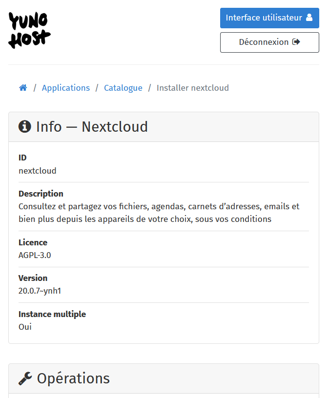
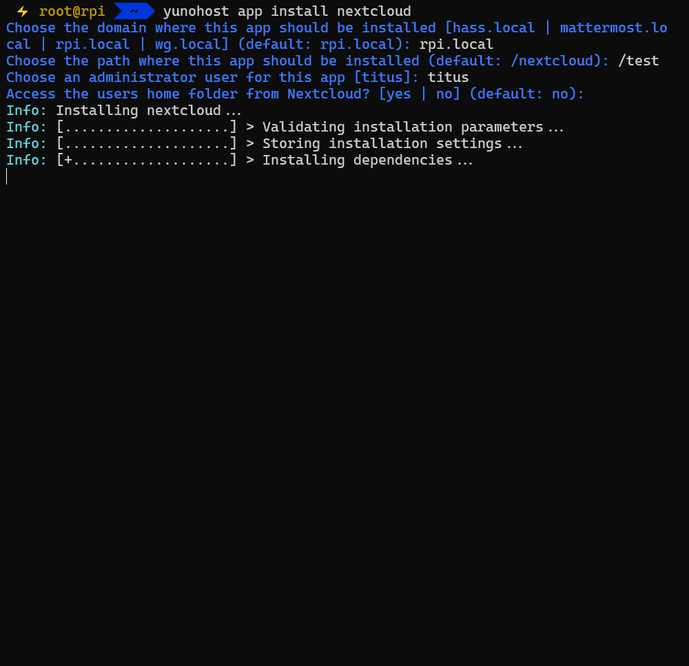
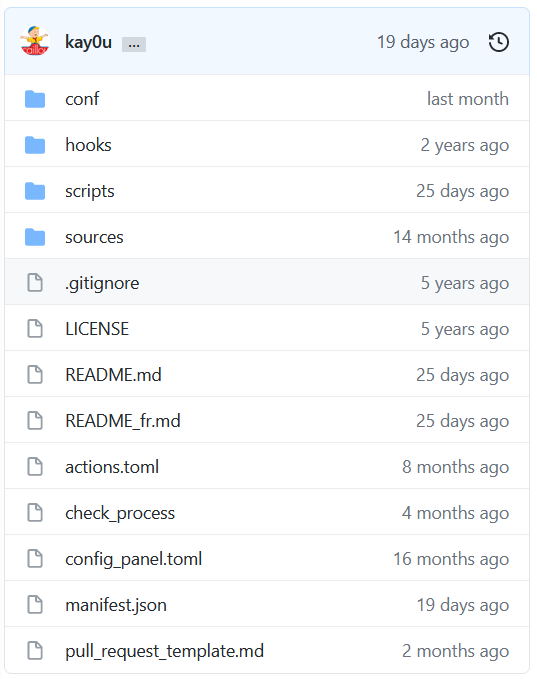
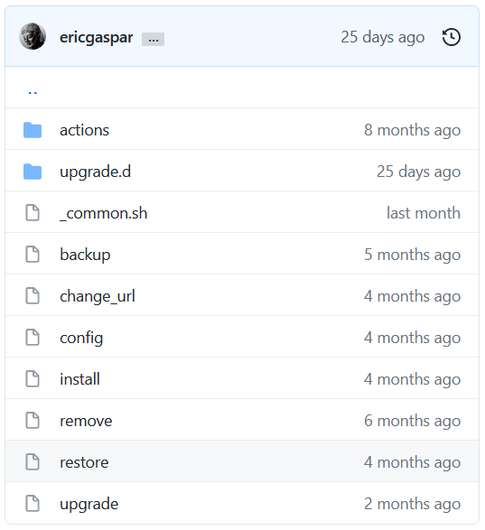

## De l'auto-hébergement à l'élevage de CHATONS

### Journées du Logiciel Libre
### 2022-04-03

----

 

`tituspijean`

---

## Sommaire

1. Introduction : reprenez le contrôle
2. YunoHost : une solution simple pour l'auto-hébergement
3. Côté administrateur ($\hookleftarrow$ c'est vous !)
4. Côté technique ($\hookleftarrow$ promis, c'est accessible)
5. Côté communauté

---

## Introduction

----

<small>Illustration par JimboJoe</small>

----

### Où stockez-vous vos données ?

* Sur papier ?
* Votre disque dur, clé USB, ...
* Fournisseurs de services (*drive, *box, *cloud)

----

<!-- .slide: data-background-image="./uploads/772bfb484e4a105c48ba0f702.jpg" data-background-size="contain" data-background-color="black" -->

 
 
 
 
 
 
 
 
 
 
 

### Envoi de données vers le nuage
<!-- .element style="color: white;" -->
*Incendie d'un centre de données d'OVH,
à Strasbourg, mars 2021*
<!-- .element style="color: white;" -->

----

----

* (Re)possession des données
* Décentralisation
* Vie privée
* Liberté d'expression
* Auto-didactisme <!-- .element class="fragment" style="width: 100%" -->

## $\implies$ Motivations à l'auto-hébergement
<!-- .element class="fragment" style="width: 100%" -->

----

## Le matériel pour s'auto-héberger

   

----

## Les logiciels à auto-héberger

|             | Alternatives libres |
| ----------- | -------- |
| Twitter |  Mastodon |
| Dropbox, GDrive, iCloud... |  Nextcloud |
| Office 365 |  Cryptpad |
| Tout système de domotique |  Home Assistant |
| Messenger, Whatsapp, Wechat... |  |
<!-- .element style="width: 90%" -->

**... chacun avec ses propres prérequis
et instructions d'installation**

---

<!-- .slide: data-background-image="https://64.media.tumblr.com/4b3b0287ca43ce1021340cd692f65f9f/tumblr_mj7iufgKNi1qghl49o1_500.gifv" -->

----

## Il est *nécessaire* de rendre l'administration de serveurs __simple__

----

# , c'est quoi ?
-  une distribution Debian
<!-- .element class="fragment" style="width: 100%" -->
-  une interface d'administration simple
<!-- .element class="fragment" style="width: 100%" -->
-  des services fonctionnels dès l'installation
<!-- .element class="fragment" style="width: 100%" -->
-  des noms de domaines gratuits et automatiquement configurés (`.ynh.fr`, `.nohost.me`, `.noho.st`)
-  vos propres noms de automatiquement configurés chez vos *registrars*.
<!-- .element class="fragment" style="width: 100%" -->
-  un grand catalogue d'applications installables en quelques clics 
<!-- .element class="fragment" style="width: 120%" -->
-  un portail de connexion pour les personnes inscrites
<!-- .element class="fragment" style="width: 100%" -->
-  un système de permissions pour contrôler les accès aux apps
<!-- .element class="fragment" style="width: 100%" -->
-  un système de diagnostic pour surveiller tout ça
<!-- .element class="fragment" style="width: 100%" -->

----

## YunoHost, côté utilisateur/administrateur
### Une petite démo ?

https://demo.yunohost.org

---

## YunoHost, côté technique

----

### Installable en moins d'une heure

   

----

### Automatisation des tâches de sysadmin

Accessibles via l'interface web ou la ligne de commande

  

----

### Les applications

Des fichiers de description, de configuration,
et des scripts Bash pour laisser la magie opérer.

\+ un système de tests automatisés pour aider les *packagers*

----

### Feuille de route

- YunoHost version 11 (Debian Bullseye) : en version bêta :rocket:
- L'intégration de nom de domaines *wildcard*
- Des formulaires d'inscription et des liens d'inscription de comptes utilisateurs
- Une évolution du système de *packaging* pour encore plus facilement intégrer des applications au catalogue
- ...

---

## YunoHost, côté communauté

----

### Plus de 8000 instances YunoHost

*Source: Shodan*

----

#  $\times$ <!--vs.? --> 

> CHATONS est le **Collectif des Hébergeurs Alternatifs, Transparents, Ouverts, Neutres et Solidaires**. Ce collectif vise à rassembler des structures proposant des services en ligne libres, éthiques et décentralisés.

`https://chatons.org/`

Une quinzaine de CHATONS tourne avec YunoHost. :rocket:

<!-- .element style="width: 90%" -->

----

### Un catalogue d'applications fourni

208 pleinement fonctionnelles sur 236 testées

 ... il y a un an ! Actuellement :

325 pleinement fonctionnelles sur 344 testées
512 dépôts de code dans notre organisation `YunoHost-Apps`

----

### Nous trouver

* Le site web de YunoHost : [yunohost.org](https://yunohost.org)
* Le forum pour les annonces et l'entraide : [forum.yunohost.org](https://forum.yunohost.org)
* Des salons sur Matrix/IRC de discussion et d'entraide pour le support, le *packaging* d'apps, le développement : [yunohost.org/chat_rooms](https://yunohost.org/fr/chat_rooms)
* La documentation : [yunohost.org/doc](https://yunohost.org/docs)

 contributeurs  (Python, UX, HTML, CSS, JS, Bash, doc ...)

----

#  Nos soutiens

et donateurs !

----

## Dans les coulisses...

* Présentation faite avec [Reveal.js](https://revealjs.com/) sur [HedgeDoc](https://hedgedoc.org/)...
* ... que j'accède avec mon VPN avec [WireGuard](https://wireguard.com)...
* ... le tout auto-hébergé sur mon serveur 

---

# Avez-vous des questions ?

---

# Atelier
## Installation et découverte de 
### Espace Public Numérique

*Dans un instant*
